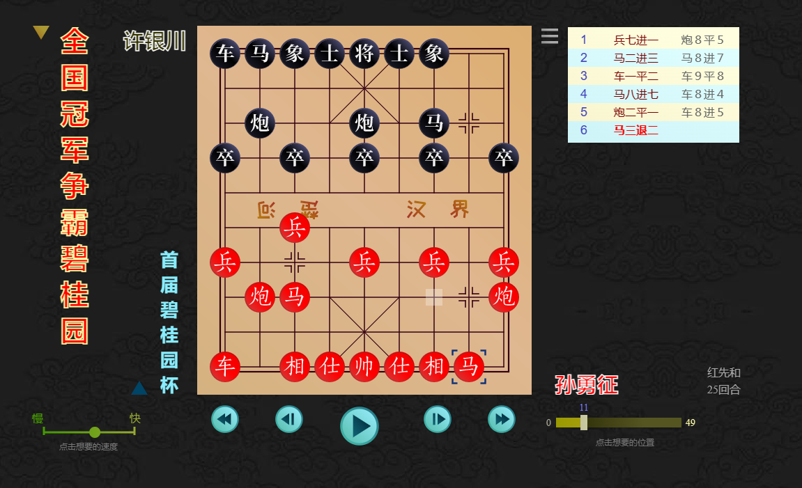

# 象棋棋谱播放器

象棋棋谱播放器是由 github 运行的静态 HTML5 应用，打开[https://fun4xq.github.io](https://fun4xq.github.io)即可运行。

图示为播放器的界面。棋盘下方是典型的播放器控制件，可以切换自动和手动播放。在手动状态下，可以选择前进、后退、局初、局末等动作。左方的滚动条显示自动播放的速率，点击滚动条上的某一点可以改变该速率。右方的滚动条显示当前棋局位置，点击滚动条上的一点可以切换棋局位置。点击棋书书名右下方的图标会显示所有棋书（或棋谱录）的总目录，以供选择。点击棋局名字左上方的图标会显示当前棋书所包含的棋局子目录。点击棋盘右上角的图标，可以切换到不同的棋盘风格。

这一款棋谱播放器内置海量的各类棋谱。多种古籍珍本提供精妙的残局攻杀构思，由不得人不细细把玩。四套闯关攻略，由易转难，层层迭进，趣味迥然。观赏名家对局，即让人领会何为名家风范，另一边春风化雨，潜移默化，在无形中提高棋力。软件互搏的对局会使你见识到神仙打架的各种鬼魅武功。

中国象棋与国际象棋及围棋并列世界三大棋类之一。主要流行于汉文化圈，包括中国大陆、香港、台湾、马来西亚、新加坡、越南、琉球地区。韩国将棋起源于中国象棋，属中国象棋的一脉分支。日本将棋起源于唐代宝应象棋，因此与现代中国象棋有很大的不同。

鉴于中国象棋世界范围的普及程度和影响，历届届世界智力运动会都将其纳入正式比赛项目之一。
